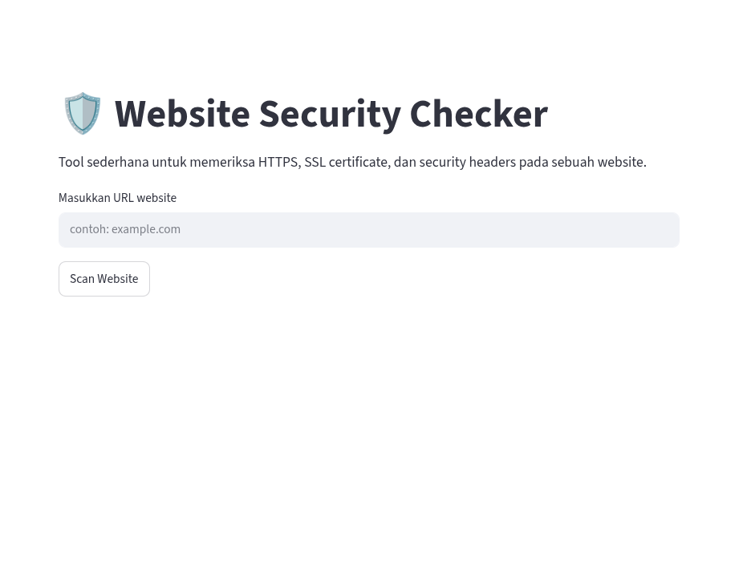
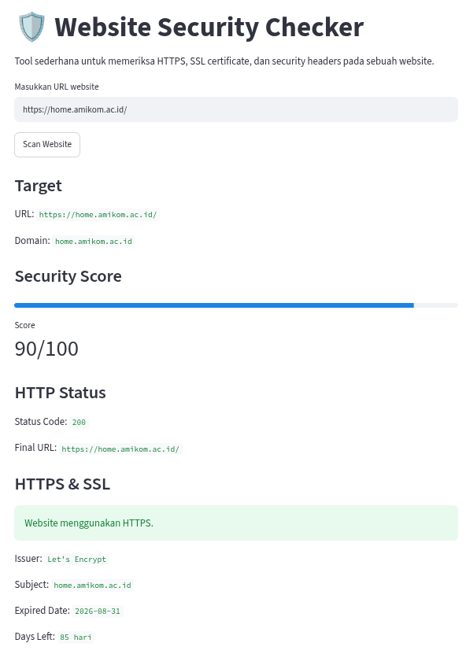
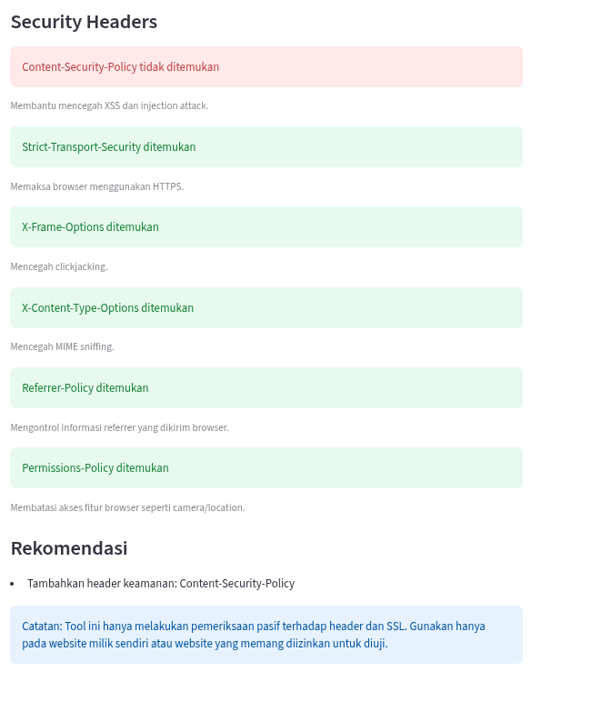

# 🛡️ Website Security Checker

Website Security Checker adalah aplikasi berbasis Python dan Streamlit yang digunakan untuk memeriksa konfigurasi keamanan dasar pada sebuah website.

Project ini dibuat sebagai portofolio Cyber Security dengan pendekatan **passive security assessment**, seperti pemeriksaan HTTPS, SSL Certificate, dan Security Headers tanpa melakukan eksploitasi atau pengujian invasif terhadap target.

---

## 📷 Preview

### Home Page



### Security Analysis



### Security Headers & Recommendations



---

## ✨ Features

- HTTPS Detection
- SSL Certificate Validation
- SSL Expiration Check
- HTTP Status Code Analysis
- Security Headers Inspection:
  - Content-Security-Policy (CSP)
  - Strict-Transport-Security (HSTS)
  - X-Frame-Options
  - X-Content-Type-Options
  - Referrer-Policy
  - Permissions-Policy
- Security Score Calculation
- Security Improvement Recommendations

---

## 🛠️ Tech Stack

- Python
- Streamlit
- Requests
- SSL
- Socket

---

## 📂 Project Structure

```text
website-security-checker/
│
├── assets/
│   ├── home.png
│   ├── analysis.png
│   └── headers.png
│
├── app.py
├── requirements.txt
├── README.md
└── .gitignore
```

---

## 🚀 Installation

Clone repository:

```bash
git clone https://github.com/Naufalganta/website-security-checker.git
```

Masuk ke folder project:

```bash
cd website-security-checker
```

Buat virtual environment:

```bash
python3 -m venv venv
```

Aktifkan virtual environment:

```bash
source venv/bin/activate
```

Install dependencies:

```bash
pip install -r requirements.txt
```

Jalankan aplikasi:

```bash
streamlit run app.py
```

---

## 📋 Example Usage

Masukkan URL atau domain website:

```text
example.com
```

Aplikasi akan melakukan:

1. Pemeriksaan HTTPS
2. Validasi SSL Certificate
3. Analisis Security Headers
4. Perhitungan Security Score
5. Pemberian rekomendasi keamanan

---

## 🔒 Ethical Use

Tool ini hanya melakukan pemeriksaan pasif terhadap konfigurasi website dan tidak melakukan eksploitasi maupun perubahan terhadap sistem target.

Gunakan hanya pada:

- Website milik sendiri
- Lingkungan lab/praktikum
- Website yang memang memberikan izin untuk diuji

---

## 👨‍💻 Developer

**Naufal Ganta**

Python Developer • Web Developer • Cyber Security Enthusiast

GitHub: https://github.com/Naufalganta